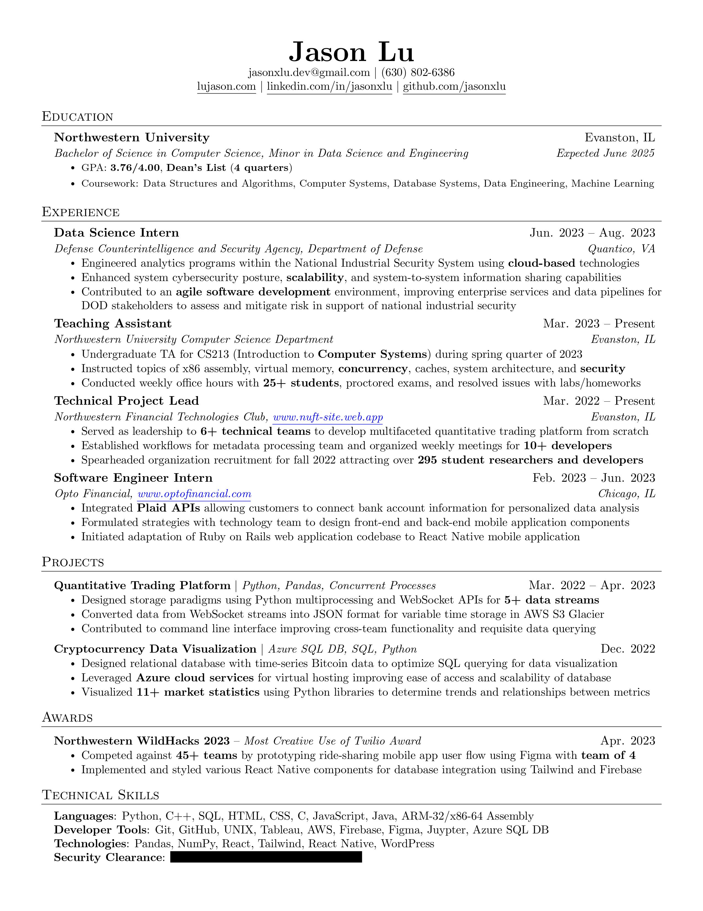

<!-- Modal  -->

 
    &times;
    
    

    

            <a href="assets/Resume.pdf" class="button special icon fa-download" target="_blank" rel="noopener noreferrer" download="Resume">Download</a>
    

