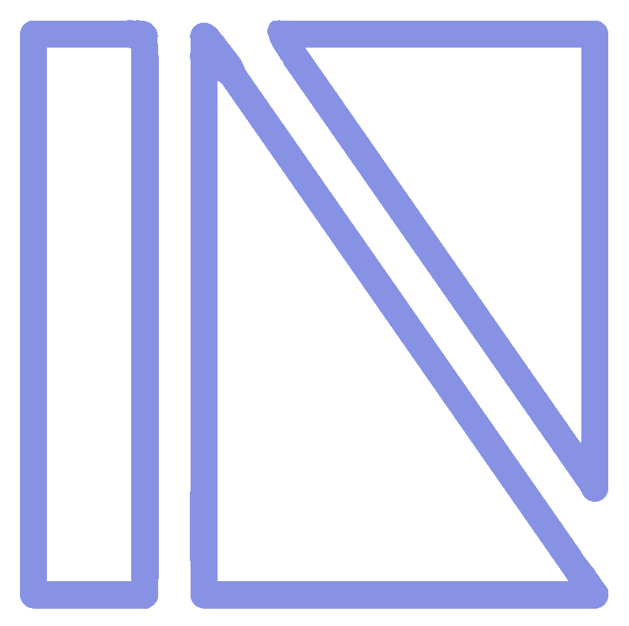
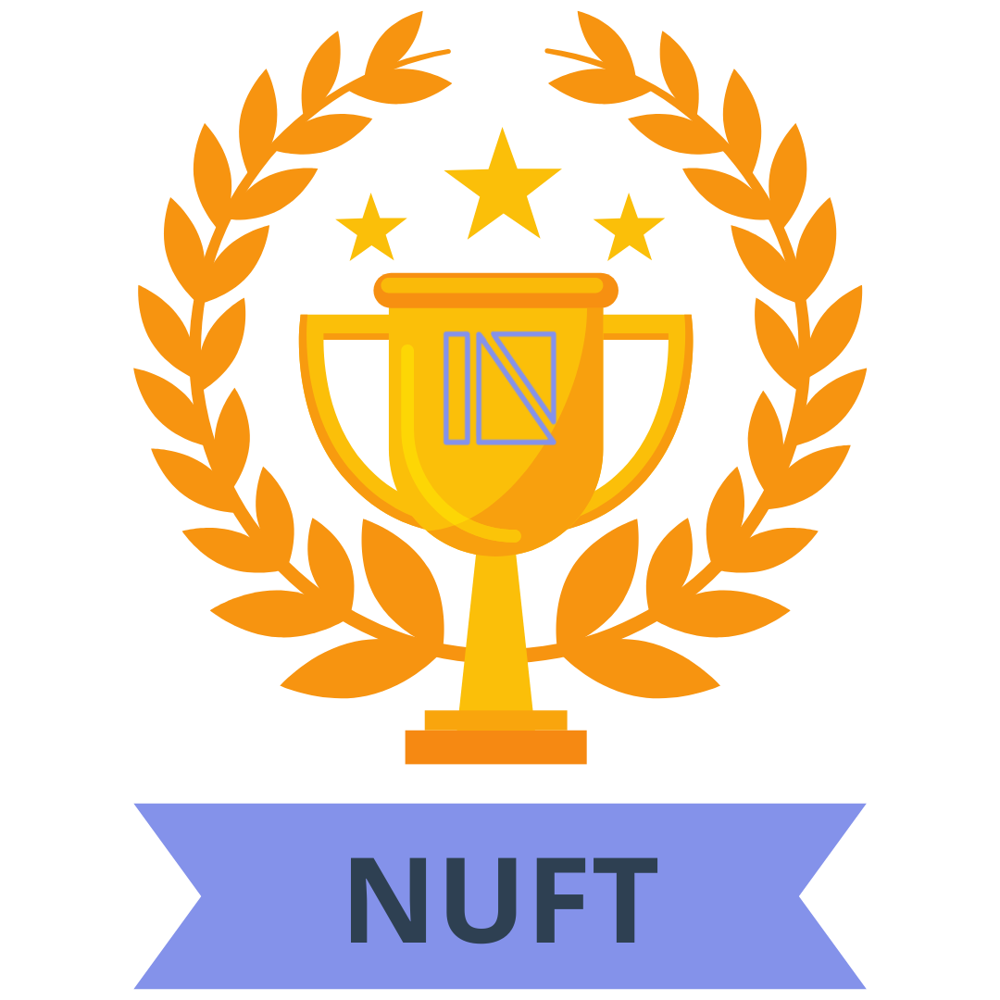
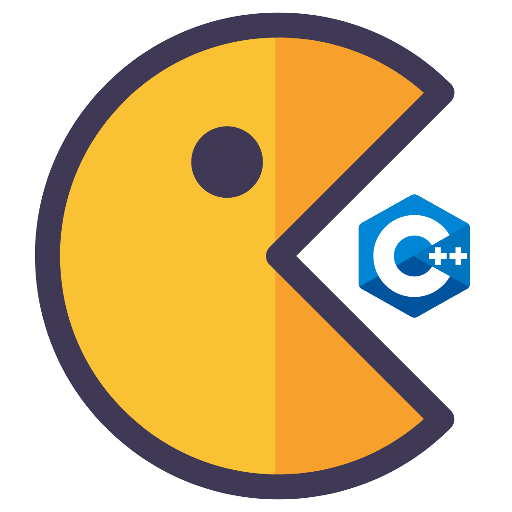
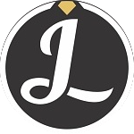
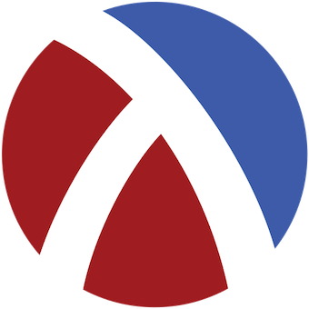
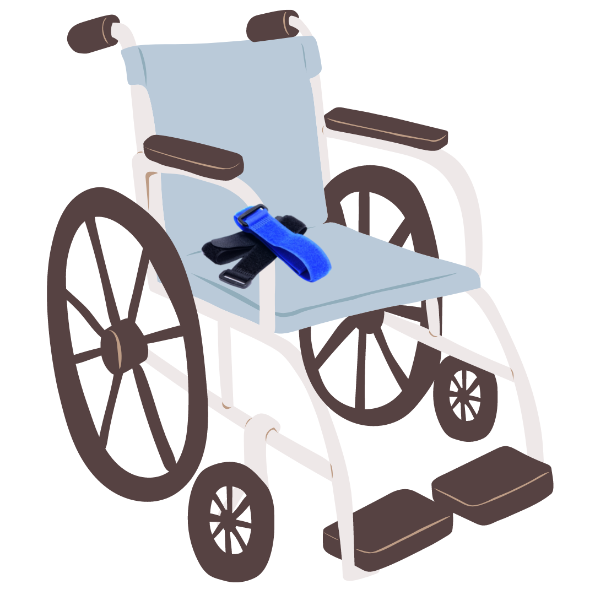
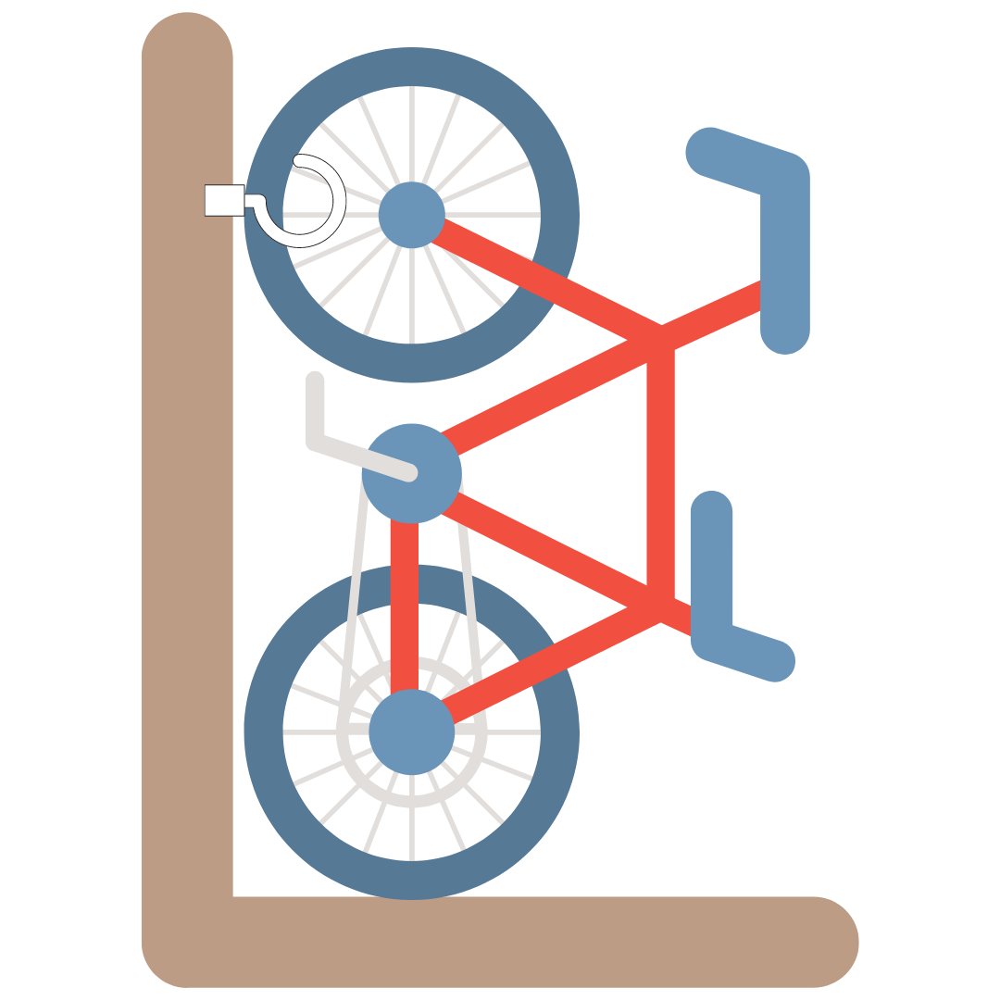

<!-- Main -->

<!-- One -->
<section style="display:flex; flex-wrap:wrap; margin-bottom:20px;">
  

    
    

      <h4><b>Quantitaive Trading Platform</b></h4>
      
Systems Infrastructure Development, Data Management, CI/CD Pipelines, Project Management, Organization Leadership

      <ul class="actions">
					<li style="padding-bottom:15px"><a href="https://github.com/echavemann/NUFT" target="_blank" class="button">GitHub Repo</a></li>
          <li style="padding-bottom:15px"><a href="https://nuft.notion.site/nuft/Northwestern-University-FinTech-Club-7aaab23485bb4d55a3032fd87951fb7c" target="_blank" class="button special">Notion</a></li>
          <li style="padding-bottom:15px"><a href="https://northwesternfintech.github.io/" target="_blank" class="button">Website</a></li>
				</ul>
    

  

  

    
    

      <h4><b>Leetcode Leaderboard</b></h4>
      
Basic Web Design and Styling, APIs, GraphQL Querying, Version Controlled, Real Time Statistics

      <ul class="actions">
					<li><a href="https://github.com/northwesternfintech/LCLeaderboard" target="_blank" class="button">GitHub Repo</a></li>
					<li><a href="https://lc-leaderboard-eta.vercel.app/" target="_blank" class="button special">Website</a></li>
				</ul>
    

  

  

    
    

      <h4><b>Stock Exchange Interface</b></h4>
      
Intermediate Web Design, Web Frameworks [React.js, TailwindCSS, Next.js], Data Steams, WebSockets and RESTful APIs, Git

      <ul class="actions">
					<li><a href="https://github.com/northwesternfintech" target="_blank" class="button">GitHub Repo</a></li>
					<!-- <li><a href="404.html" class="button special">Website</a></li> -->
				</ul>
    

  

  

    
    

      <h4><b>Pac-Man++</b></h4>
      
Pure C++ Game Development, SDL2 Subset Game Engine, GUI Development, Custom Graphics

      <ul class="actions">
					<li><a href="https://github.com/Jasonxlu/Pac-Man-PlusPlus" target="_blank" class="button">GitHub Repo</a></li>
					<li><a href="https://youtu.be/f8vTbcUvP50" target="_blank" class="button special">Video Demo</a></li>
				</ul>
    

  

  

    
    

      <h4><b>Web Portfolio</b></h4>
      
Jekyll and Github Pages Hosting, Custom HTML/CSS/JS, Web Template Overhaul

      <ul class="actions">
					<li><a href="https://github.com/Jasonxlu/Jasonxlu.github.io" target="_blank" class="button">GitHub Repo</a></li>
				</ul>
    

  

  

    
    

      <h4><b>Text Adventure Game</b></h4>
      
Written in Lisp-based language Racket, Introductory Game Development, Loosely based off Minecraft

      <ul class="actions">
					<li><a href="https://github.com/Jasonxlu/RacketGame" target="_blank" class="button">GitHub Repo</a></li>
				</ul>
    

  

  

    
    

      <h4><b>Wheelchair Seatbelt Storage</b></h4>
      
10 Week Engineering Design Project, Client Communication, Rapid Prototyping, Remote-based

      <ul class="actions">
					<li><a href="https://www.linkedin.com/in/jasonlu230/overlay/1635493821217/single-media-viewer?type=DOCUMENT&profileId=ACoAACWFKxkBNYy40EQ0NrAq1Dk1fVWEgezhFTQ&lipi=urn%3Ali%3Apage%3Ad_flagship3_profile_view_base%3BTm3KpXHsTp2wdT%2BP763syA%3D%3D" target="_blank" class="button">Final Report</a></li>
				</ul>
    

  

  

    
    

      <h4><b>Condominium Bike Storage System</b></h4>
      
10 Week Engineering Design Project, Small Team Management, On-site Interviews, Solution Research and Documentation

      <ul class="actions">
					<li><a href="https://www.linkedin.com/in/jasonlu230/overlay/experience/1943238299/multiple-media-viewer?profileId=ACoAACWFKxkBNYy40EQ0NrAq1Dk1fVWEgezhFTQ&treasuryMediaId=1635487655487&lipi=urn%3Ali%3Apage%3Ad_flagship3_profile_view_base%3BXCCeocgXRqCnvwBSB%2FbNUw%3D%3D" target="_blank" class="button">Final Report</a></li>
				</ul>
    

  

</section>

<!-- Two -->
<section id="one">
	

		<header class="major">
			<h2>Skills</h2>
		</header>
		<blockquote> 
		<b>Languages: </b> Python, Java, C, C++, JavaScript, Typescript, HTML, CSS, SASS, Markdown, Racket 
		<b>Technologies: </b>Git, React.js, Next.js, Firebase, Tailwind, NodeJS, MATLAB, UNIX Shell, GitHub, Figma, MySQL, Jekyll, Docker, Jenkins, WebSocket 
		</blockquote>
  

<table id="tech">
  <tr>
    <td align="center" height="108" width="108">
      
       <strong>HTML5</strong>
    </td>
    <td align="center" height="108" width="108">
      
       <strong>CSS3</strong>
    </td>
    <td align="center" height="108" width="108">
      
       <strong>JavaScript</strong>
    </td>
    <td align="center" height="108" width="108">
      
       <strong>TypeScript</strong>
    </td>
    <td align="center" height="108" width="108">
      
       <strong>React</strong>
    </td>
    <td align="center" height="108" width="108">
      
       <strong>Python</strong>
    </td>
    <td align="center" height="108" width="108">
      
       <strong>C++</strong>
    </td>
   
  </tr>
  <tr>
    <td align="center" height="108" width="108">
      
       <strong>Node.js</strong>
    </td>
    <td align="center" height="108" width="108">
      
       <strong>Java</strong>
    </td>
    <td align="center" height="108" width="108">
      
       <strong>Firebase</strong>
    </td>
    <td align="center" height="108" width="108">
      
       <strong>Git</strong>
    </td>
    <td align="center" height="108" width="108">
      
       <strong>Npm</strong>
    </td>
    <td align="center" height="108" width="108">
      
       <strong>Docker</strong>
    </td>
    <td align="center" height="108" width="108">
      
       <strong>MATLAB</strong>
    </td>
  </tr>

  <tr>
    <td align="center" height="108" width="108">
      
       <strong>Nextjs</strong>
    </td>
    <td align="center" height="108" width="108">
      
       <strong>GitHub</strong>
    </td>
    <td align="center" height="108" width="108">
      
       <strong>TailwindCSS</strong>
    </td>
    <td align="center" height="108" width="108">
      
       <strong>UNIX</strong>
    </td>
    <td align="center" height="108" width="108">
      
       <strong>Jenkins</strong>
    </td>
    <td align="center" height="108" width="108">
      
       <strong>C</strong>
    </td>
    <td align="center" height="108" width="108">
      
       <strong>GraphQL</strong>
    </td>
  </tr>
</table>
	

</section>

<!-- Two -->
<!-- <section id="two" class="spotlights">
	<section>
		
		

			

				<header class="major">
					<h3>Northwestern Financial Technologies Club</h3>
				</header>
				

					<ul>
						<li>Deployed official NUFT website with custom HTML, CSS, JS, SASS to establish central hub for club activities and inquiries</li>
						<li>Developed and documented storage paradigms for 5+ data input streams using Python Multiprocessing and WebSocket</li>
            <li>Coordinated with leadership and technical teams to better integrate APIs and backend data pipelines with CLI</li>
            <li>Established team workflow and organized weekly meetings to actively track progress of systems development</li>
            <li>Building trading site for Northwestern University Stock Exchange to facilitate high volume stock market simulations</li>
            <li>Created overarching club overview in Figma to facilitate faster and more efficient onboarding</li>
            <li>Designed and constructed basic Command Line Interface foundation to enable uniform data acquisition and analysis from project teams </li>
					</ul>
				

				<ul class="actions">
					<li style="padding-bottom:15px"><a href="https://github.com/echavemann/NUFT" target="_blank" class="button">GitHub Repo</a></li>
          <li style="padding-bottom:15px"><a href="https://www.figma.com/file/135OhNv3xmb5eRGRCNNFAZ/Northwestern-Financial-Technology-Club?node-id=0%3A1" target="_blank" class="button">Figma</a></li>
          <li style="padding-bottom:15px"><a href="https://nuft.notion.site/nuft/Northwestern-University-FinTech-Club-7aaab23485bb4d55a3032fd87951fb7c" target="_blank" class="button special">Notion</a></li>
          <li style="padding-bottom:15px"><a href="https://northwesternfintech.github.io/" target="_blank" class="button special">Website</a></li>
				</ul>
			

		

	</section>
  <section>
		
		

			

				<header class="major">
					<h3>NUFT LeetCode Leaderboard </h3>
				</header>
				

					<ul>
						<li>Developed custom LC leaderboard for NUFT to boost intrinsic motivation of members for technical interview prep</li>
						<li>Statically rendered and updated ranking of members using GraphQL queries to LeetCode API to pull real-time stats</li>
						<li>Deployed with Vercel on GitHub to create CI/CD pipeline for streamlined development and deployment </li>
					</ul>
				

				<ul class="actions">
					<li><a href="https://github.com/northwesternfintech/LCLeaderboard" target="_blank" class="button">GitHub Repo</a></li>
					<li><a href="https://lc-leaderboard-eta.vercel.app/" target="_blank" class="button special">Website</a></li>
				</ul>
			

		

	</section>
	<section>
		
		

			

				<header class="major">
					<h3>NUSE Trade Site</h3>
				</header>
				

					<ul>
						<li>Actively Building official Northwestern University Stock Exchange website using React, Typescript, Next.js, and TailwindCSS to establish a platform for stock market simulations</li>
					</ul>
				

				<ul class="actions">
					<li><a href="https://github.com/northwesternfintech" target="_blank" class="button">GitHub Repo</a></li>
					<li><a href="#" class="button special">Website</a></li>
				</ul>
			

		

	</section>
	<section>
		
		

			

				<header class="major">
					<h3>Pac-Man++</h3>
				</header>
				

					<ul>
						<li>Constructed Pac-Man game from scratch using GE211 game engine in C++ dev environment with Git version control</li>
						<li>Built user-interactive GUI using Model-View-Controller architectural pattern to enable player-driven gameplay</li>
						<li>Designed multiple level progression with custom sprites, 2D hitboxes, event handlers, and conclusive unit-testing</li>
					</ul>
				

				<ul class="actions">
					<li><a href="https://github.com/Jasonxlu/Pac-Man-PlusPlus" target="_blank" class="button">GitHub Repo</a></li>
					<li><a href="https://youtu.be/f8vTbcUvP50" target="_blank" class="button special">Video Demo</a></li>
				</ul>
			

		

	</section>
  <section>
		
		

			

				<header class="major">
					<h3>Web Portfolio</h3>
				</header>
				

					<ul>
						<li>Produced personalized HTML, CSS, JS, and Markdown snippets to host technical projects and applications on the web</li>
						<li>Employed simple static web hosting using Jekyll and GitHub pages to optimize website ease-of-access and reliability</li>
					</ul>
				

				<ul class="actions">
					<li><a href="https://github.com/Jasonxlu/Jasonxlu.github.io" target="_blank" class="button">GitHub Repo</a></li>
				</ul>
			

		

	</section>
	<section>
		
		

			

				<header class="major">
					<h3>Text-Based Adventure Game</h3>
				</header>
				

					<ul>
						<li>Minecraft inspired text-based adventure game written in the Racket programming language for CS111 at Northwestern</li>
						<li>Utilized pair programming and functional LISP programming to develop a multi-leveled progression system</li>
						<li>Concluded with unit-testing in the form of a complete walkthrough</li>
					</ul>
				

				<ul class="actions">
					<li><a href="https://github.com/Jasonxlu/RacketGame" target="_blank" class="button">GitHub Repo</a></li>
				</ul>
			

		

	</section>
	<section>
		
		

			

				<header class="major">
					<h3>Wheelchair Seatbelt Storage | Sleeve-It</h3>
				</header>
				

					<ul>
						<li>Second 10-week design project as a part of Northwestern's Design Thinking & Education II Course</li>
						<li>Project culminated in Sleeve-It, a simple yet efficient storage system for disengaged wheelchair seatbelts.</li>
						<li>Gained experience in client communications and design testing as the point of contact when designing prototypes for the Shirley Ryan Ability Lab (SRAL) in Chicago</li>
					</ul>
				

				<ul class="actions">
					<li><a href="https://www.linkedin.com/in/jasonlu230/overlay/1635493821217/single-media-viewer?type=DOCUMENT&profileId=ACoAACWFKxkBNYy40EQ0NrAq1Dk1fVWEgezhFTQ&lipi=urn%3Ali%3Apage%3Ad_flagship3_profile_view_base%3BTm3KpXHsTp2wdT%2BP763syA%3D%3D" target="_blank" class="button">Final Report</a></li>
				</ul>
			

		

	</section>
	<section>
		
		

			

				<header class="major">
					<h3>Condominium Bike Storage | HookUp</h3>
				</header>
				

				<ul>
						<li>10 Week design project as a part of Northwestern's Design Thinking & Communication I Engineering Course</li>
						<li>Gained experience in project management and product development through prototyping bike storage solution</li>
						<li>Culminated in a space efficient and accessible bike storage system tackling issues of physical strain and space optimization for the 3440 N. Lake Shore Drive Condominimums</li>
					</ul>
				

				<ul class="actions">
					<li><a href="https://www.linkedin.com/in/jasonlu230/overlay/experience/1943238299/multiple-media-viewer?profileId=ACoAACWFKxkBNYy40EQ0NrAq1Dk1fVWEgezhFTQ&treasuryMediaId=1635487655487&lipi=urn%3Ali%3Apage%3Ad_flagship3_profile_view_base%3BXCCeocgXRqCnvwBSB%2FbNUw%3D%3D" target="_blank" class="button">Final Report</a></li>
				</ul>
			

		

	</section>
</section> -->

