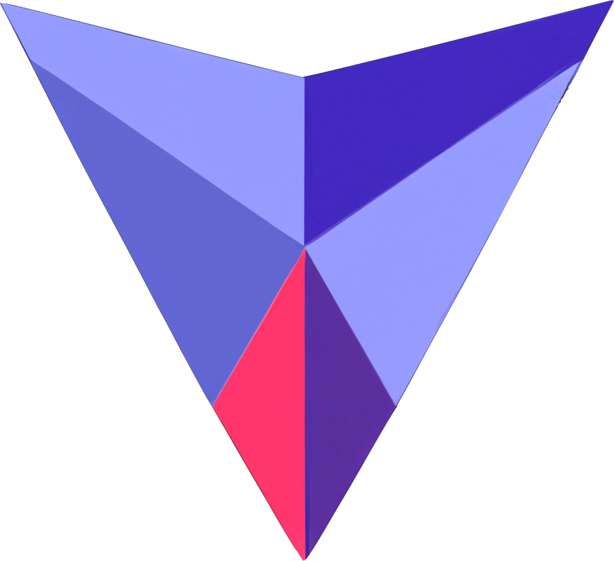
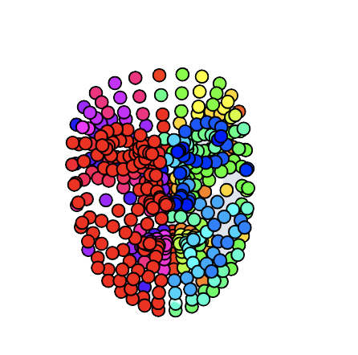

<!-- Main -->

<!-- One -->
<section id="cards" style="display:flex; flex-wrap:wrap;">

  

    
    

      <h4><b>Bitcoin Data Visualization</b></h4>
      
Azure Cloud Databases, Microsoft SQL Server, Relational design, Python Application, Matplotlib, Data Cleaning

      

					<a href="https://github.com/Jasonxlu/BitcoinDatabase" target="_blank" class="button fit">GitHub Repo</a>
			

    

  

  

    
    

      <h4><b>Quantitative Trading Platform</b></h4>
      
Systems Infrastructure Development, Data Management, CI/CD Pipelines, Project Management, Organization Leadership

      

				<a href="https://github.com/echavemann/NUFT" target="_blank" class="button fit">GitHub Repo</a>
        <!-- <a href="https://nuft.notion.site/nuft/Northwestern-University-FinTech-Club-7aaab23485bb4d55a3032fd87951fb7c" target="_blank" class="button special fit">Notion</a> -->
        <a href="https://northwesternfintech.github.io/" target="_blank" class="button special fit">Website</a>
      

    

  

  

    
    

      <h4><b>Leetcode Leaderboard</b></h4>
      
Basic Web Design and Styling, APIs, GraphQL Querying, Version Controlled, Real Time Statistics

      

					<a href="https://github.com/northwesternfintech/LCLeaderboard" target="_blank" class="button fit">GitHub Repo</a>
					<a href="https://lc-leaderboard-eta.vercel.app/" target="_blank" class="button special fit">Website</a>
				

    

  

  

    
    

      <h4><b>Stock Exchange Interface</b></h4>
      
Intermediate Web Development, Web Frameworks [React.js, TailwindCSS, Next.js], Data Steams, WebSockets and RESTful APIs, Git

      

					<a href="https://github.com/northwesternfintech" target="_blank" class="button fit">GitHub Repo</a>
			

    

  

  

    
    

      <h4><b>Pac-Man++</b></h4>
      
Pure C++ Game Development, SDL2 Subset Game Engine, GUI Development, Custom Graphics

      

					<a href="https://github.com/Jasonxlu/Pac-Man-PlusPlus" target="_blank" class="button fit">GitHub Repo</a>
					<a href="https://youtu.be/f8vTbcUvP50" target="_blank" class="button special fit">Video Demo</a>
			

    

  

  

    
    

      <h4><b>Web Portfolio</b></h4>
      
Jekyll and Github Pages Hosting, Custom HTML/CSS/JS, Web Template Overhaul

      

					<a href="https://github.com/Jasonxlu/Jasonxlu.github.io" target="_blank" class="button fit">GitHub Repo</a>
			

    

  

  

    
    

      <h4><b>Text Adventure Game</b></h4>
      
Written in Lisp-based language Racket, Introductory Game Development, Loosely based on Minecraft

      

					<a href="https://github.com/Jasonxlu/RacketGame" target="_blank" class="button fit">GitHub Repo</a>
			

    

  

  

    
    

      <h4><b>Wheelchair Seatbelt Storage</b></h4>
      
10 Week Engineering Design Project, Client Communication, Rapid Prototyping, Remote-based

      

					<a href="https://www.linkedin.com/in/jasonlu230/overlay/1635493821217/single-media-viewer?type=DOCUMENT&profileId=ACoAACWFKxkBNYy40EQ0NrAq1Dk1fVWEgezhFTQ&lipi=urn%3Ali%3Apage%3Ad_flagship3_profile_view_base%3BTm3KpXHsTp2wdT%2BP763syA%3D%3D" target="_blank" class="button fit">Final Report</a>
			

    

  

  

    
    

      <h4><b>Condominium Bike Storage System</b></h4>
      
10 Week Engineering Design Project, Small Team Management, On-site Client Interviews, Solution Research and Documentation

      

					<a href="https://www.linkedin.com/in/jasonlu230/overlay/experience/1943238299/multiple-media-viewer?profileId=ACoAACWFKxkBNYy40EQ0NrAq1Dk1fVWEgezhFTQ&treasuryMediaId=1635487655487&lipi=urn%3Ali%3Apage%3Ad_flagship3_profile_view_base%3BXCCeocgXRqCnvwBSB%2FbNUw%3D%3D" target="_blank" class="button fit">Final Report</a>
			

    

  

</section>

<section id="cards" style="display:flex; flex-wrap:wrap;">
   

    
    

      <h4><b>Generative Methods Collection</b></h4>
      
JS Animations, Processing, APIs, Machine Learning, Neural Networks, Data Visualization, Hand and Face Tracking, Chat Bots

      

					<a href="https://json-a2.glitch.me" target="_blank" class="button">Animations</a>
          <a href="https://json-a3.glitch.me" target="_blank" class="button">Interactive Tools</a>
          <a href="https://json-a4.glitch.me" target="_blank" class="button">Particles</a>
          <a href="https://json-a5.glitch.me" target="_blank" class="button">Evolutions</a>
          <a href="https://json-a6.glitch.me" target="_blank" class="button">Chat-bots</a>
          <a href="https://json-a7.glitch.me" target="_blank" class="button">Data Visualization</a>
          <a href="https://json-a8.glitch.me" target="_blank" class="button">Body Tracking</a>
          <a href="https://json-a9.glitch.me" target="_blank" class="button">Machine Learning</a>
			

    

  

</section>

<!-- Two -->
<section id="one">
	

		<header class="major">
			<h2>Skills</h2>
		</header>
		<blockquote> 
		<b>Technologies I have worked with:</b>
		</blockquote>

<table id="tech">
  <tr>
    <td align="center" height="108" width="108">
      
       <strong>HTML5</strong>
    </td>
    <td align="center" height="108" width="108">
      
       <strong>CSS3</strong>
    </td>
    <td align="center" height="108" width="108">
      
       <strong>JavaScript</strong>
    </td>
    <td align="center" height="108" width="108">
      
       <strong>TypeScript</strong>
    </td>
    <td align="center" height="108" width="108">
      
       <strong>React</strong>
    </td>
    <td align="center" height="108" width="108">
      
       <strong>Python</strong>
    </td>
    <td align="center" height="108" width="108">
      
       <strong>C++</strong>
    </td>
   
  </tr>
  <tr>
    <td align="center" height="108" width="108">
      
       <strong>Node.js</strong>
    </td>
    <td align="center" height="108" width="108">
      
       <strong>Java</strong>
    </td>
    <td align="center" height="108" width="108">
      
       <strong>Firebase</strong>
    </td>
    <td align="center" height="108" width="108">
      
       <strong>Git</strong>
    </td>
    <td align="center" height="108" width="108">
      
       <strong>Npm</strong>
    </td>
    <td align="center" height="108" width="108">
      
       <strong>Docker</strong>
    </td>
    <td align="center" height="108" width="108">
      
       <strong>MATLAB</strong>
    </td>
  </tr>

  <tr>
    <td align="center" height="108" width="108">
      
       <strong>Nextjs</strong>
    </td>
    <td align="center" height="108" width="108">
      
       <strong>Figma</strong>
    </td>
    <td align="center" height="108" width="108">
      
       <strong>TailwindCSS</strong>
    </td>
    <td align="center" height="108" width="108">
      
       <strong>UNIX</strong>
    </td>
    <td align="center" height="108" width="108">
      
       <strong>Numpy</strong>
    </td>
    <td align="center" height="108" width="108">
      
       <strong>C</strong>
    </td>
    <td align="center" height="108" width="108">
      
       <strong>GraphQL</strong>
    </td>
  </tr>
  <tr>
    <td align="center" height="108" width="108">
      
       <strong>Azure</strong>
    </td>
    <td align="center" height="108" width="108">
      
       <strong>MySQL</strong>
    </td>
    <td align="center" height="108" width="108">
      
       <strong>Sqlite</strong>
    </td>
    <td align="center" height="108" width="108">
      
       <strong>Minitab</strong>
    </td>
    <td align="center" height="108" width="108">
      
       <strong>Bootstrap</strong>
    </td>
    <td align="center" height="108" width="108">
      
       <strong>Vim</strong>
    </td>
    <td align="center" height="108" width="108">
      
       <strong>Canva</strong>
    </td>
  </tr>
</table>
	

</section>

